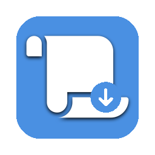

# Auto PDF Scroller



A lightweight application that automatically scrolls through PDF documents at configurable speeds. Perfect for hands-free reading, presentations, or studying.

[](assets/demo.mov)

## Download

Get the latest release from the [Releases Page](https://github.com/AntonioMolteni/auto-pdf-scroller/releases).

**Try it online**: [Web Version](https://antoniomolteni.github.io/auto-pdf-scroller/)

**macOS Security Note:** If you see _"Auto PDF Scroller is damaged"_, run:

```bash
xattr -c "/Applications/Auto PDF Scroller.app"
```

## Features

- **Automatic Scrolling**: Smooth autoscroll at adjustable speeds (0.5x - 8x)
- **Multi-File Support**: Load entire folders and navigate between PDFs
- **Browser Caching**: Web version remembers your PDFs across page refreshes
- **Manual Pause**: Auto-pauses when you scroll manually, resumes after 3 seconds
- **Keyboard Shortcuts**: `Space` to play/pause, Arrow keys to adjust speed
- **Persistent Settings**: Remembers your last folder

## Development

### Prerequisites

- Node.js 16+ and npm

### Setup

```bash
# Clone and install
git clone https://github.com/AntonioMolteni/auto-pdf-scroller.git
cd auto-pdf-scroller
npm install

# Run Electron app
npm run electron

# Run web version
npm run web
```

### Building

```bash
# Build for desktop (outputs to dist-electron/)
npm run build:electron

# Build for web (outputs to dist-web/)
npm run build:web
```

## Tech Stack

- **Electron** 39.2.4 - Desktop framework
- **PDF.js** 3.11.174 - PDF rendering
- **Vite** - Web bundler
- **Tailwind CSS** - Styling

## Architecture Highlights

- Time-based animation with `requestAnimationFrame`
- Fractional pixel accumulation for smooth low-speed scrolling
- EMA delta smoothing to reduce frame rate jitter
- Responsive flexbox layout

## Author

**Antonio Molteni**
